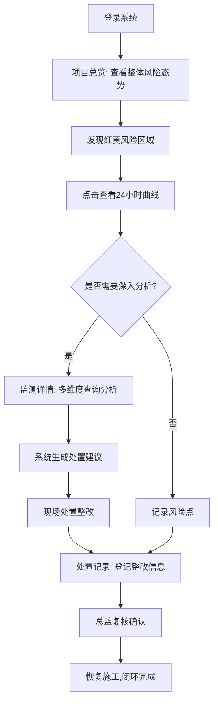

## 1. 产品概述
高支模监测驾驶舱是面向建筑工程项目经理、总监理工程师和安全总监的实时监测管理平台，用于统一掌握多个楼栋、多个浇筑面的高支模风险状态，预防施工安全事故。

- **核心价值**：将分散的传感器数据集中可视化，通过绿黄红三色风险等级直观展示，支撑快速决策和闭环管理
- **目标用户**：项目经理、总监理工程师、安全总监
- **使用场景**：办公室日常监控、周例会风险追溯、应急处置指挥

## 2. 核心特性

### 2.1 用户角色

| 角色 | 注册方式 | 核心权限 |
|------|----------|----------|
| 项目经理 | 企业账号分配 | 查看所有监测数据、审批处置记录、发起整改 |
| 总监理工程师 | 企业账号分配 | 查看监测数据、审核整改方案、签署复核意见 |
| 安全总监 | 企业账号分配 | 查看监测数据、登记处置记录、跟踪整改闭环 |

### 2.2 功能模块

1. **项目总览页**：多楼栋风险总览、浇筑面状态矩阵、24小时趋势曲线、报警统计
2. **监测详情页**：多维度查询、峰值分析、速率计算、阈值对比、智能处置建议
3. **处置记录页**：整改登记、责任人追踪、复核流程、恢复时间管理、历史追溯

### 2.3 页面详情

| 页面名称 | 模块名称 | 功能描述 |
|----------|----------|----------|
| 项目总览 | 楼栋导航 | 左侧楼栋列表，点击切换不同楼栋视图 |
| 项目总览 | 浇筑面矩阵 | 按轴线×楼层展示所有浇筑面，色块表示风险等级 |
| 项目总览 | 指标卡片 | 展示立杆沉降、模板侧移、架体倾斜、浇筑进度四大指标 |
| 项目总览 | 趋势弹窗 | 点击浇筑面弹出24小时曲线图和报警次数统计 |
| 项目总览 | 报警概览 | 顶部统计今日/本周报警数量，按等级分类 |
| 监测详情 | 查询区域 | 支持构件编号、传感器点位搜索，日期范围选择 |
| 监测详情 | 数据面板 | 展示监测峰值、平均变化速率、当前值、阈值对比 |
| 监测详情 | 历史曲线 | 可缩放的时间序列图表，支持多指标叠加对比 |
| 监测详情 | 处置建议 | 根据风险等级自动生成"继续观察/暂停浇筑/组织复核"建议 |
| 处置记录 | 记录列表 | 按时间倒序展示所有整改记录，支持筛选和搜索 |
| 处置记录 | 新增表单 | 填写问题描述、责任人、整改措施、照片说明 |
| 处置记录 | 复核流程 | 标记复核人、复核时间、复核结论 |
| 处置记录 | 闭环管理 | 记录恢复施工时间，形成完整处置闭环 |

## 3. 核心流程

用户进入系统后，首先在项目总览页浏览整体风险态势，发现红色/黄色高风险区域后点击查看详细趋势。如需深入分析，跳转至监测详情页进行多维度数据查询和阈值比对，根据系统建议采取相应措施。处置完成后，在处置记录页登记整改全过程，形成可追溯的安全管理档案。

## 4. 界面设计

### 4.1 设计风格
- **主色调**：深海军蓝 `#0F172A` 作为背景，营造专业可靠的工业驾驶舱氛围
- **风险色**：绿色 `#10B981`（正常）、黄色 `#F59E0B`（预警）、红色 `#EF4444`（报警）
- **辅助色**：科技蓝 `#3B82F6` 用于交互元素，冷灰 `#64748B` 用于次要信息
- **字体**：标题使用 `Space Grotesk` 展现工业科技感，正文使用 `Noto Sans SC` 保证中文可读性
- **布局**：卡片式模块化布局，左上角导航、顶部状态栏、中央主内容区
- **视觉元素**：网格背景、微光边框、数据发光效果、细微噪点纹理

### 4.2 页面设计概览

| 页面名称 | 模块名称 | UI元素 |
|----------|----------|--------|
| 项目总览 | 顶部状态栏 | 项目名称、当前时间、在线设备数、三级报警统计卡片、用户头像 |
| 项目总览 | 楼栋侧栏 | 竖向楼栋列表，当前选中楼栋高亮，显示楼栋进度条 |
| 项目总览 | 风险矩阵 | 热力图式浇筑面网格，悬停显示微数据，点击弹出详情弹窗 |
| 项目总览 | 指标面板 | 四个大尺寸指标卡片，带趋势箭头和环比变化百分比 |
| 项目总览 | 趋势弹窗 | 深色背景带发光效果的模态框，ECharts曲线图 + 报警列表 |
| 监测详情 | 查询栏 | 下拉选择器、日期输入框、搜索框，紧凑排列 |
| 监测详情 | 数据卡片 | 峰值/速率/当前值/阈值四象限布局，进度条展示阈值占比 |
| 监测详情 | 图表区 | 大尺寸折线图，支持图例切换、缩放、数据点悬浮提示 |
| 监测详情 | 建议卡片 | 带图标的建议面板，根据风险等级变色，附处置依据说明 |
| 处置记录 | 筛选栏 | 状态筛选、时间范围、责任人筛选 |
| 处置记录 | 记录列表 | 时间线式列表，每条记录含状态标签、责任人标签、操作按钮 |
| 处置记录 | 表单弹窗 | 分步表单，支持上传图片预览，必填项校验 |

### 4.3 响应式设计
- **桌面优先**：以1920×1080为主要设计分辨率，适配常见办公显示器
- **中等屏幕**：1280px以上保持完整布局，适当压缩间距
- **平板适配**：1024px以下侧栏改为可折叠，矩阵区域支持横向滚动
- **触控优化**：按钮最小尺寸44px，弹窗区域增加触控边距

## 5. 交互与动效

### 5.1 微交互
- **风险矩阵悬停**：色块放大1.05倍，边框发光，显示详细指标气泡
- **页面切换**：淡入淡出过渡，内容区域从下往上滑入
- **数据刷新**：数字滚动变化，新数据点在图表上有"点亮"动画
- **报警闪烁**：红色报警区域有轻微呼吸灯效果，吸引注意力

### 5.2 数据可视化
- **曲线图**：平滑曲线，区域渐变填充，数据点悬停显示十字准线
- **进度条**：浇筑进度使用圆角进度条，带动画填充效果
- **风险仪表盘**：半圆形仪表盘，指针平滑过渡到当前数值
