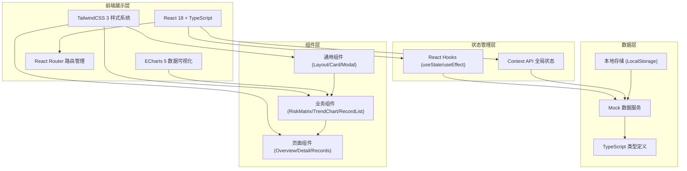

## 1. 架构设计



## 2. 技术描述

- **前端框架**：React 18 + TypeScript 5 + Vite 5
- **样式方案**：TailwindCSS 3.4 + CSS 变量主题系统
- **路由管理**：React Router DOM 6
- **图表组件**：ECharts 5.4 (for React)
- **图标库**：Lucide React
- **数据方案**：Mock 数据 + TypeScript 类型定义
- **初始化工具**：npm create vite@latest
- **构建工具**：Vite 5
- **代码规范**：ESLint + Prettier

## 3. 路由定义

| 路由路径 | 页面名称 | 说明 |
|----------|----------|------|
| `/` | 项目总览 | 默认首页，展示多楼栋风险矩阵和整体态势 |
| `/overview` | 项目总览 | 与根路径相同，项目总览页面 |
| `/detail` | 监测详情 | 监测数据查询分析页面，支持多维度筛选 |
| `/records` | 处置记录 | 整改记录管理页面，支持新增、查看、复核 |

## 4. 数据模型定义

### 4.1 核心数据类型

```typescript
// 风险等级枚举
export type RiskLevel = 'normal' | 'warning' | 'alarm';

// 楼栋信息
export interface Building {
  id: string;
  name: string;
  totalFloors: number;
  axes: string[];
  progress: number;
}

// 浇筑面信息
export interface PouringArea {
  id: string;
  buildingId: string;
  floor: number;
  axis: string;
  status: RiskLevel;
  settlement: number;      // 立杆沉降 (mm)
  lateralDisplacement: number; // 模板侧移 (mm)
  inclination: number;     // 架体倾斜 (°)
  pouringProgress: number; // 浇筑进度 (%)
  alarmCount24h: number;
  warningCount24h: number;
  updateTime: string;
}

// 监测点数据
export interface SensorData {
  id: string;
  componentId: string;     // 构件编号
  sensorId: string;        // 传感器点位
  timestamp: string;
  settlement: number;
  lateralDisplacement: number;
  inclination: number;
}

// 24小时趋势数据
export interface TrendData {
  time: string;
  value: number;
}

// 处置记录
export interface DisposalRecord {
  id: string;
  areaId: string;
  buildingName: string;
  floor: number;
  axis: string;
  issueDescription: string;
  riskLevel: RiskLevel;
  personInCharge: string;
  reviewer: string;
  rectificationMeasures: string;
  photoUrls: string[];
  photoDescription: string;
  createTime: string;
  reviewTime?: string;
  recoveryTime?: string;
  status: 'pending' | 'reviewing' | 'completed';
  reviewConclusion?: string;
}

// 处置建议
export interface DisposalSuggestion {
  level: RiskLevel;
  action: 'observe' | 'pause' | 'review';
  title: string;
  description: string;
  basis: string;
}

// 阈值配置
export interface ThresholdConfig {
  settlement: { warning: number; alarm: number };
  lateralDisplacement: { warning: number; alarm: number };
  inclination: { warning: number; alarm: number };
}
```

### 4.2 默认阈值配置

```typescript
export const DEFAULT_THRESHOLDS: ThresholdConfig = {
  settlement: { warning: 8, alarm: 15 },        // mm
  lateralDisplacement: { warning: 5, alarm: 10 }, // mm
  inclination: { warning: 0.3, alarm: 0.5 },    // 度
};
```

## 5. 核心工具函数

```typescript
// 根据数值和阈值判断风险等级
export function getRiskLevel(value: number, thresholds: { warning: number; alarm: number }): RiskLevel {
  if (value >= thresholds.alarm) return 'alarm';
  if (value >= thresholds.warning) return 'warning';
  return 'normal';
}

// 综合多个指标的风险等级
export function getOverallRiskLevel(area: PouringArea, thresholds: ThresholdConfig): RiskLevel {
  const levels = [
    getRiskLevel(area.settlement, thresholds.settlement),
    getRiskLevel(area.lateralDisplacement, thresholds.lateralDisplacement),
    getRiskLevel(area.inclination, thresholds.inclination),
  ];
  if (levels.includes('alarm')) return 'alarm';
  if (levels.includes('warning')) return 'warning';
  return 'normal';
}

// 计算变化速率 (mm/h)
export function calculateRate(data: TrendData[]): number {
  if (data.length < 2) return 0;
  const first = data[0];
  const last = data[data.length - 1];
  const hours = (new Date(last.time).getTime() - new Date(first.time).getTime()) / (1000 * 60 * 60);
  return hours > 0 ? (last.value - first.value) / hours : 0;
}

// 生成处置建议
export function generateSuggestion(level: RiskLevel): DisposalSuggestion {
  const suggestions: Record<RiskLevel, DisposalSuggestion> = {
    normal: {
      level: 'normal',
      action: 'observe',
      title: '继续观察',
      description: '当前各项指标在安全范围内，可继续正常施工。',
      basis: '依据《建筑施工临时支撑结构技术规范》JGJ300-2013',
    },
    warning: {
      level: 'warning',
      action: 'review',
      title: '组织复核',
      description: '部分指标接近预警阈值，应立即组织技术人员现场复核，加密监测频率。',
      basis: '预警值达到阈值80%，需启动二级响应机制',
    },
    alarm: {
      level: 'alarm',
      action: 'pause',
      title: '暂停浇筑',
      description: '指标超出安全阈值，应立即暂停浇筑作业，疏散作业人员，启动应急预案。',
      basis: '监测值超过报警阈值，依据应急预案需暂停施工',
    },
  };
  return suggestions[level];
}
```

## 6. 项目目录结构

```
src/
├── components/          # 通用组件
│   ├── Layout.tsx       # 整体布局组件
│   ├── Sidebar.tsx      # 左侧楼栋导航
│   ├── Header.tsx       # 顶部状态栏
│   ├── RiskCard.tsx     # 风险卡片
│   ├── RiskMatrix.tsx   # 风险矩阵
│   ├── TrendChart.tsx   # 趋势图表
│   ├── TrendModal.tsx   # 趋势弹窗
│   ├── StatusBadge.tsx  # 状态标签
│   └── MetricCard.tsx   # 指标卡片
├── pages/               # 页面组件
│   ├── Overview.tsx     # 项目总览页
│   ├── Detail.tsx       # 监测详情页
│   └── Records.tsx      # 处置记录页
├── data/                # Mock数据
│   ├── mockBuildings.ts
│   ├── mockAreas.ts
│   ├── mockSensorData.ts
│   └── mockRecords.ts
├── types/               # 类型定义
│   └── index.ts
├── utils/               # 工具函数
│   ├── riskCalculator.ts
│   └── suggestionGenerator.ts
├── hooks/               # 自定义Hooks
│   └── usePolling.ts    # 轮询刷新Hook
├── App.tsx
├── main.tsx
└── index.css
```

## 7. 设计实现要点

### 7.1 深色主题配置
- CSS变量定义全套颜色系统
- TailwindCSS配置自定义颜色、字体
- 背景使用 `linear-gradient` + `rgba` 叠加营造深度
- 卡片使用半透明背景 + 微光边框

### 7.2 数据可视化
- ECharts 曲线图使用渐变填充区域
- 风险矩阵使用 CSS Grid 布局，hover 时 transform 放大
- 数字滚动动画使用 `requestAnimationFrame` 实现

### 7.3 性能优化
- 图表组件使用 `React.memo` 避免不必要重渲染
- 大数据量使用虚拟滚动（如处置记录列表）
- 轮询数据使用自定义 Hook 统一管理
